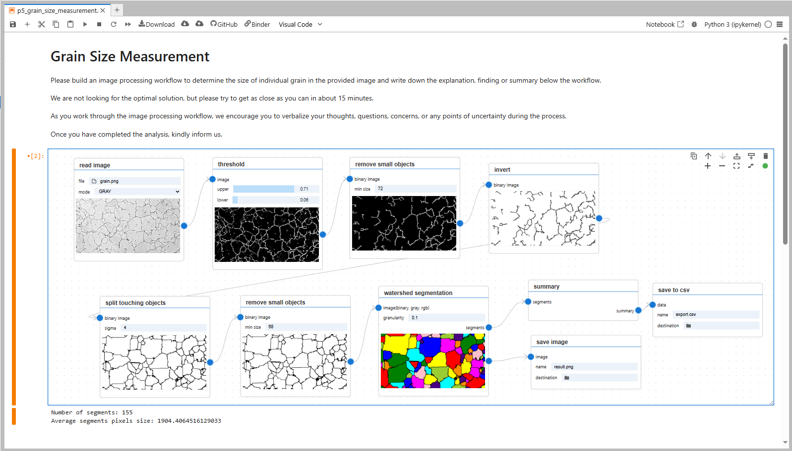

<h1 align="center">Chaldene</h1>

<p align="center">
<a href="https://pypi.org/project/chaldene/"></a>
<a href="https://mybinder.org/v2/gh/anonymizedsubmission1024/Chaldene/HEAD"></a>
<!-- <a href="https://youtu.be/CN3qY67QiXg"></a>
<a href="https://youtu.be/SYRBdU8mQMw"></a>
<a href="https://youtu.be/Oosamoa33cs"></a> -->
<a href="./LICENSE"></a>
</p>

<p align="center">
<em>Notebook-Embedded Visual Workflow Authoring for Scientific Image Processing</em>
</p>

<p align="center">

</p>

## Key Features

- Drag-and-drop node-based programming for image processing
- Image-specific inspection and comparison support, including branching, stepwise views, synchronized viewing, cursor linking, and difference overlays
- Co-locates workflow structure, parameter settings, outputs, and narrative context within a single notebook artifact during authoring

## Requirements

- **JupyterLab** ≥ 4.0.0  
- **OpenJDK 11** (required for PyImageJ)

For example, with Conda:

```bash
conda install -c conda-forge "openjdk=11"
```

## Quick Start

1. **Install Chaldene**
   ```bash
   pip install chaldene
   ```

2. **Launch JupyterLab**
   ```bash
   jupyter lab
   ```

3. **Create a new notebook**
   - Click "+" to create a new notebook
   - Add a Visual Code cell from the cell toolbar

4. **Start building workflows**
   - Drag and drop nodes to create your image processing workflows
   - Connect nodes to build workflows
   - Adjust parameters and inspect the outputs to refine the workflows

**New to Chaldene?** Watch our [tutorial video](https://youtu.be/SYRBdU8mQMw).

## Examples

📂 **Examples are available in the `use_cases/` folder**

Below are two representative workflows created by users, demonstrating Chaldene's capabilities for interactive image processing:

<p align="center">

</p>

<p align="center">

</p>

## Python API

`ChaldeneClient` lets you control VP cells from Python — useful for driving
parameters with `ipywidgets`, running parameter sweeps, or integrating VP
cells into larger notebook workflows.

```python
from chaldene import ChaldeneClient

client = ChaldeneClient()
```

Once a VP cell is visible in the notebook, `client.get_ready_cell_ids()`
returns its ID. From there you can update node inputs and re-run the cell:

```python
cell_id = client.get_ready_cell_ids()[-1]
client.set_input(cell_id, node_id='1', handle_id='in1', value=[0.2, 0.8])
client.run(cell_id)
```

Combine with `ipywidgets.interact` for live parameter control:

```python
import ipywidgets as widgets

@widgets.interact(threshold=widgets.FloatSlider(min=0.0, max=1.0, step=0.05))
def update(threshold):
    ids = client.get_ready_cell_ids()
    if ids:
        client.set_input(ids[-1], '1', 'in1', [threshold, 0.9])
        client.run(ids[-1])
```

See [`api_tutorials/`](api_tutorials/) for full working examples.

## Development

- 📖 [Developer Guide](docs/README_DEVELOP.md) - Setup and development instructions
- 🚀 [Release Guide](docs/RELEASE.md) - Package Build and Releae

<!--
## Cite

If you use this package in your research, please cite our paper:

**For the visual programming environment:**
```bibtex
@INPROCEEDINGS{chen2022Chaldene,
  author={Chen, Fei and Slusallek, Philipp and Müller, Martin and Dahmen, Tim},
  booktitle={2022 IEEE Symposium on Visual Languages and Human-Centric Computing (VL/HCC)}, 
  title={Chaldene: Towards Visual Programming Image Processing in Jupyter Notebooks}, 
  year={2022},
  volume={},
  number={},
  pages={1-3},
  doi={10.1109/VL/HCC53370.2022.9832910}}
```
-->
